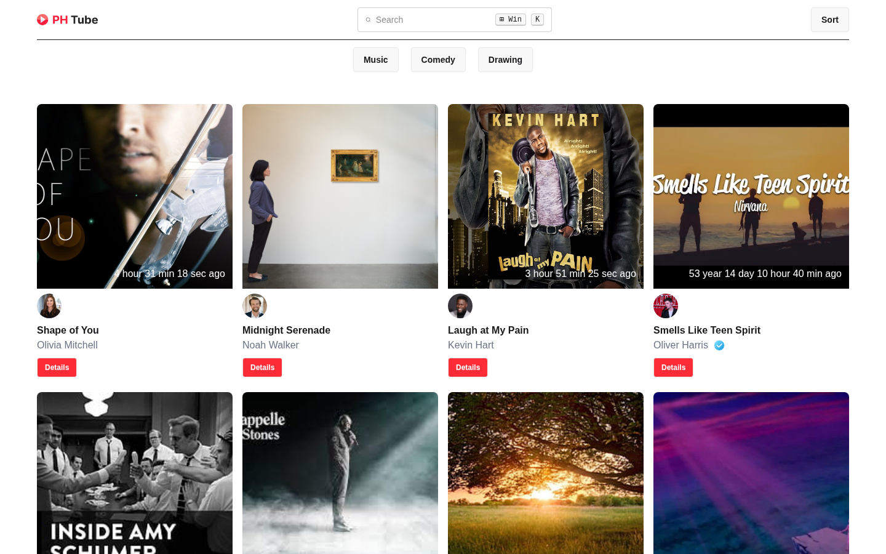
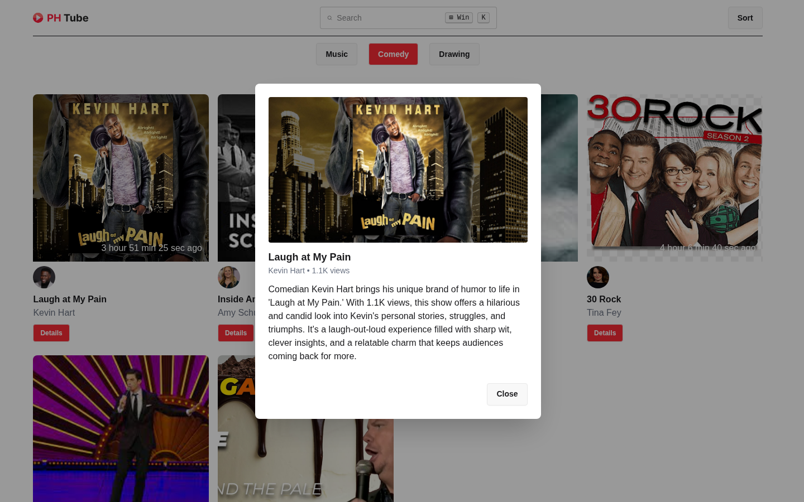
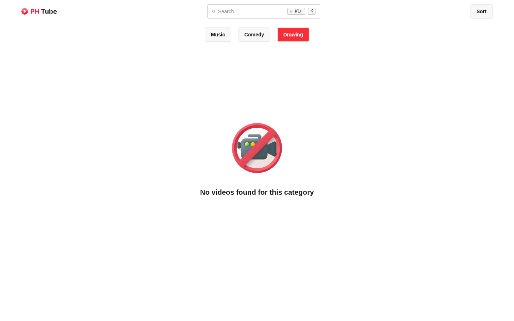

<p align="center">
  
</p>

<p align="center">
  A video browsing web app built with vanilla JavaScript, Tailwind CSS and daisyUI.<br/>
  Browse videos by category, search by title and view video details — all powered by a REST API.
</p>

<p align="center">
  
</p>

## Features

- **Dynamic categories** — category buttons are loaded from the API
- **Active category** — the selected category button turns red
- **Video cards** — thumbnail, author, verified badge and "time ago" upload label
- **Video details** — the red **Details** button opens a modal with the full description
- **Search by title** — results update as you type, even with a single letter
- **Empty state** — a "No videos found" message for categories with no videos

## Screenshots

### Video details modal

Clicking **Details** fetches the video from the API and shows it in a modal. The active category (Comedy) is highlighted in red.



### Search by title

Typing in the search box shows only the videos whose title matches.


### No videos found

Categories without any videos show an empty-state message.



## Tech Stack

- HTML5
- [Tailwind CSS v4](https://tailwindcss.com/) (browser CDN)
- [daisyUI v5](https://daisyui.com/)
- Vanilla JavaScript (Fetch API)

## Getting Started

No build step is needed. Clone the repo and open `index.html` in a browser, or serve it locally:

```bash
git clone https://github.com/mahmudscode/PH_TUBE.git
cd PH_TUBE
python -m http.server 8000
```

Then open [http://localhost:8000](http://localhost:8000).

## Project Structure

```text
PH_TUBE/
├── index.html        # Page layout, navbar and details modal
├── script/
│   └── video.js      # API calls and DOM rendering
├── icon/             # Logo and "no videos" icon
└── screenshots/      # README images
```

## API Reference

Base URL: `https://openapi.programming-hero.com/api/phero-tube`

| Purpose | Endpoint | Example |
| --- | --- | --- |
| All categories | `/categories` | [/categories](https://openapi.programming-hero.com/api/phero-tube/categories) |
| All videos | `/videos` | [/videos](https://openapi.programming-hero.com/api/phero-tube/videos) |
| Videos by category | `/category/:categoryId` | [/category/1001](https://openapi.programming-hero.com/api/phero-tube/category/1001) |
| Videos by title | `/videos?title=:title` | [/videos?title=shape](https://openapi.programming-hero.com/api/phero-tube/videos?title=shape) |
| Video details | `/video/:videoId` | [/video/aaac](https://openapi.programming-hero.com/api/phero-tube/video/aaac) |
